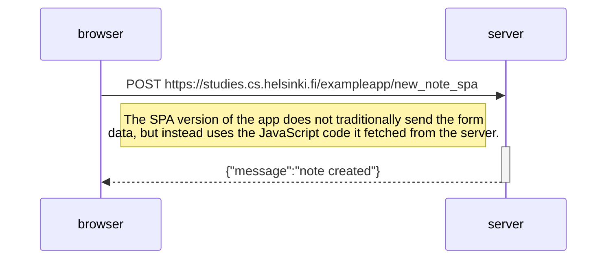

```mermaid
sequenceDiagram
    participant browser
    participant server

    browser->>server: POST https://studies.cs.helsinki.fi/exampleapp/new_note_spa
    Note right of browser: The SPA version of the app does not traditionally send the form <br/>data, but instead uses the JavaScript code it fetched from the server.
    activate server
    server-->>browser: {"message":"note created"}
    deactivate server
```